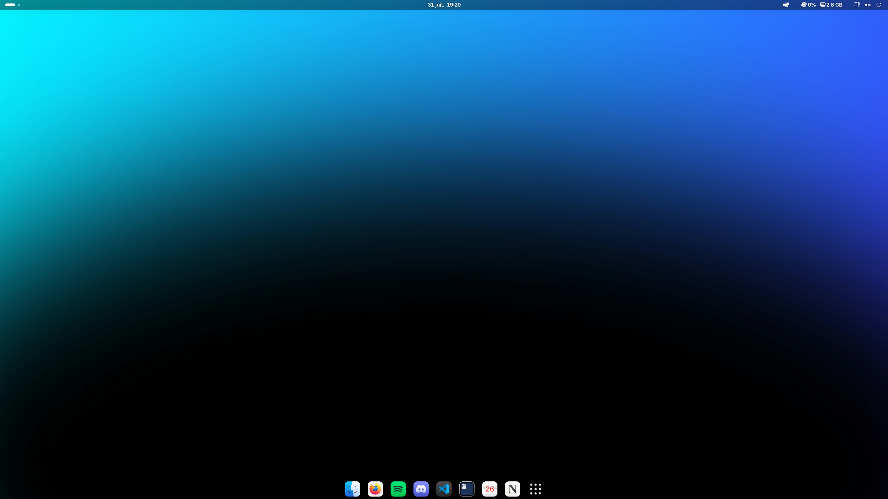
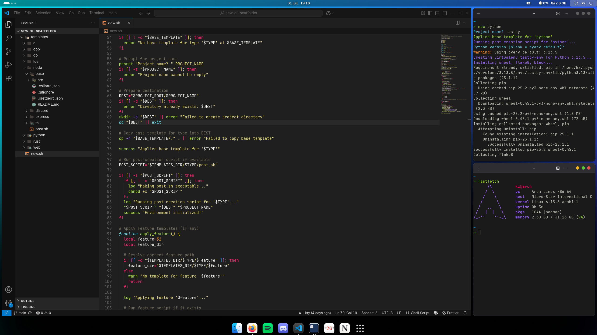

# dotfiles

### Usage

1. Install [chezmoi](https://www.chezmoi.io/)
   ```
   sudo pacman -S chezmoi
   ```
2. Import and apply dotfiles
   ```
   chezmoi init 1kty --apply
   ```
   _this will also install required packages, yay, themes, enable services and apply settings_
3. Once in GNOME, launch ghostty and install extensions
   ```
   gext install Bluetooth-Battery-Meter@maniacx.github.com blur-my-shell@aunetx clipboard-history@alexsaveau.dev dash2dock-lite@icedman.github.com just-perfection-desktop@just-perfection mediacontrols@cliffniff.github.com top-bar-organizer@julian.gse.jsts.xyz quick-settings-avatar@d-go user-theme@gnome-shell-extensions.gcampax.github.com Vitals@CoreCoding.com
   ```

### Screenshots

_Desktop_

_Tiling Mode_


### Software used

- Distro: [Arch](https://archlinux.org/)
- DE: [GNOME](https://www.gnome.org/)
- GTK Theme: [WhiteSur](https://github.com/vinceliuice/WhiteSur-gtk-theme)
- Icons: [WhiteSur Icons](https://github.com/vinceliuice/WhiteSur-icon-theme)
- Terminal: [Ghostty](https://ghostty.org/)
- Shell: [ZSH](https://www.zsh.org/)
- Editor: [Visual Studio Code](https://code.visualstudio.com/)
- GNOME Extensions:
  - [Bluetooth-Battery-Meter@maniacx.github.com](https://extensions.gnome.org/extension/6670/bluetooth-battery-meter/)
  - [blur-my-shell@aunetx](https://extensions.gnome.org/extension/3193/blur-my-shell/)
  - [clipboard-history@alexsaveau.dev](https://extensions.gnome.org/extension/4839/clipboard-history/)
  - [dash2dock-lite@icedman.github.com](https://extensions.gnome.org/extension/4994/dash2dock-lite/)
  - [just-perfection-desktop@just-perfection](https://extensions.gnome.org/extension/3843/just-perfection/)
  - [mediacontrols@cliffniff.github.com](https://extensions.gnome.org/extension/4470/media-controls/)
  - [top-bar-organizer@julian.gse.jsts.xyz](https://extensions.gnome.org/extension/4356/top-bar-organizer/)
  - [quick-settings-avatar@d-go](https://extensions.gnome.org/extension/5506/user-avatar-in-quick-settings/)
  - [user-theme@gnome-shell-extensions.gcampax.github.com](https://extensions.gnome.org/extension/19/user-themes/)
  - [Vitals@CoreCoding.com](https://extensions.gnome.org/extension/1460/vitals/)
  - [pop-shell@system76.com](https://github.com/pop-os/shell)
  - [appindicatorsupport@rgcjonas.gmail.com](https://extensions.gnome.org/extension/1301/ubuntu-appindicators/)
